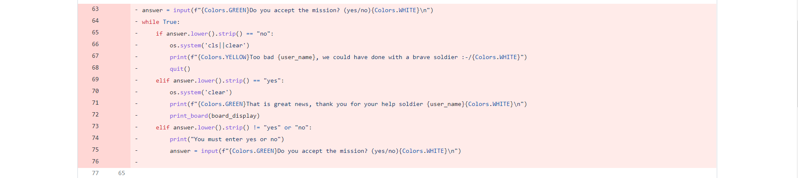
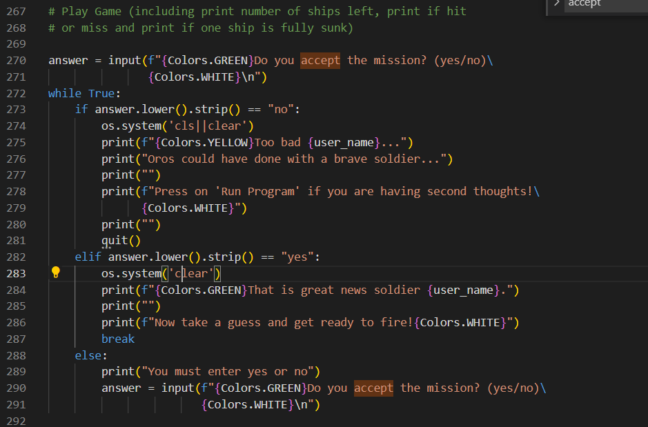

# Thirty Shots Battleships

This game constitutes my third Project Portfolio with [Code Institute](https://github.com/Code-Institute-Org). 
The project runs in a CLI, is deployed via [Heroku](https://www.heroku.com/), and uses Python.

Thirty Shots Battleships is a single player version of the popular game Battleships where the user is recruited to sink the foreign fleet of "Chatarra" preventing them for making it ashore to the fictional town of "Oros".

During the making of the game, I have particularly enjoyed using the Heroku platform as a service (PaaS). Heroku has enabled me to build, run, and operate this application entirely in the cloud.

[The live project can be found here](https://thirty-shots-battleships.herokuapp.com/)

## Features

### The title

- I developed a simple ASCII drawing for the title which basically consists of the "Thirty Shots" title itself in big letters.
- I added the word "battleships" to the right of the ASCII art in normal console letters. 
- I added a touch of blue colour by using ANSI codes.

### The Background

- As seen in the screenshot above I added a background around the actual app by modifying the layout.hml page provided by Code Institute for the project.
- This feature adds a touch of colour and front-end development to the Heroku app.
- I chose a blue background svg image with a spiral pattern suitable for the maritime theme of the game.

### Site favicon

- I have added a Ship image favicon to the site in line with the naval theme of the game.

### The plot / instructions

As explained in the game's instructions, Oros is much coveted for the precious golden mineral covering its cliffs. 
Oro's watchmen have spotted Chatarra's fleet fast approaching.
The user will have to destroy the enemy's 4 ships before they land.
If the user fails, the enemy will steal Oro's gold.
Users only have 30 cannonballs to complete their mission, hence the title of the game "Thirty Shots Battleships".
If users run out of ammunition then Chatarra's troops will make it ashore.

The instructions go on to explain the rules:
- If a ship is hit, it will be marked as 'X'
- If it's a miss, it will be marked as '-'.

### Accept / Decline the mission

- The user will be given the choice to accept or decline the mission. 
- The program will print one of the following to the console depending on the user's answer:

User enters an invalid answer:

User declines the mission:

User accepts the mission:

### Game Board

- As seen above, once the user accepts the mission, the program will print a message asking the user to take a guess and will print the game board.
- The game board consists of a 7x7 grid as, after testing, this seems like a reasonable grid size to have a fair shot at sinking all the ships in thirty shots.
- As also seen in the screenshot above, under the board will be printed the number of turns left and the number of ships left as well as the instruction "Get ready to fire" to prompt the user to keep guessing.

### Enter a guess

- Users are prompted to first enter a row guess and then a column guess.
- If the row / column number are out of range, the program will print a message prompting users to enter a valid choice.

### Miss... / Hit! / You sunk a ship!

- If a ship is hit it will be marked as 'X' on the grid and the console will print "Hit!&#128165;" in red font.
- If a ship is sunk the console will also print "You sunk a ship!&#128165;&#128165;&#128165;" in red font.
- If the user misses il will be marked as '-' on the grid and the console will print "You missed... 💦 in blue"

### Lose / Win printout

- If the user manages to sink the 4 ships in thirty shots, the console will print the following:

- If the user does not manage to sink the 4 ships in thirty shots, the console will print the following:

### Features left to implement
- Leave a space between ships so that no ships are immediately juxtaposed on the grid.

## Data model

The functionality of the game relies mainly on the class 'Ship'. This class will create the board, randomize the ship coordinates, place the ships and display the board to the user.

## Testing

### Solved bugs

1. A security issue with the Heroku app prevented any automatic deployments. The deployment had to be made from gitpod signing first into heroku and then pushing to heroku with the following commands:
    - heroku login -i (to login)
    - heroku git:remote -a thirty-shots-battleships (to select the correct app on heroku)
    - git push herouk main (to push to heroku from gitpod)

2. Code indentation issues and long lines of code were flagged on the PEP8 online validator and corrected accordingly.

3. 'Get ready to fire' appearing even after user sinks all ships. This issue was solved by replacing the location of the print line "Get ready to fire!" from directly under the definition of the function to later in the code (line 299) as part of the section appearing under the board which also displays number of turns and ships left. Following this logic once there are no more ships to sink the game will end and the "Get ready to fire!" phrase will not be printed anymore.

Before the change:

After the change:

4. Issue with placement of input question prompting user to answer if mission is accepted. I faced an issue when building the while loop incorporating the three options: yes, no, or invalid input.
    - answer == 'no' This answer worked as expected (When the user answered no the game displayed the printout "Too bad {user_name}... Oros could have done with a brave soldier...")
    - answer == 'yes' This answer worked to accept the mission and print the board but so did any other answer (e.g. maybe, not sure, blablabla, etc.) so I needed to include a third option to check for invalid input.
    - else answer: I incorporated a third entry to the while loop checking for invalid input but program did not behave as expected. The program first printed "You must enter yes or no" but at the second attempt of invalid input the program went on to prompting the user to enter a row guess even if the user had still entered an invalid input. On a second attempt to fix the problem I placed the accept mission input option directly under the instructions section and tried to recode in the following way (which ended up in a continuous loop)

    - Finally, I came up with a solution and replaced the accept mission feature in the 'play game' section (line 267) like this:

5. Background issue. I wanted to include a background around the black console to make the game a bit more interesting. I first chose a Clipart svg image showing sea cliffs (still stored in the docs file of this project). However, after many attempts of resizing the image I was not able to make this image work as it did not scale up well. This process was very time consuming and I finally dropped this Clipart image in favour of a free svg background from [svgbackgrounds.com](https://www.svgbackgrounds.com).

### Validators

- [PEP8 online check](http://pep8online.com/) was used to validate the Python code. No errors remain at the time of this submission.

- [W3 validator](https://validator.w3.org/) was used to validate the layout.html page. No errors remain at the time of this submission.

## Deployment
This project was developed by forking a specialized [Code Institute template](https://github.com/Code-Institute-Org/python-essentials-template) which simulates a terminal in the web browser.
The project has been optimized for a final [Heroku deployment](https://thirty-shots-battleships.herokuapp.com/).

The project was deployed to Heroku using the below procedure:

1. Log in to Heroku or sign up for free account
2. Select create new app from the drop-down list
3. Enter a unique app name
4. Select appropriate region to your location
5. Click create app button to proceed
6. 'Deploy' tab will be shown. scroll down to the config vars section in the settings tab
7. Click reveal config vars button
8. Enter PORT in the 'KEY' field
9. Enter 8000 in the 'VALUE' filed
10. Click the add button
11. In the buildpacks section click add buildpack button
12. Type and select 'Python' and click 'save changes' button
13. Repeat same to add 'node.js' pack
 
IMPORTANT The buildpacks must be in this particular order. If they are not, then click and drag to change it.
 
Select Github as the deployment method from the deploy tab
Connect to Github to confirm
Type repository name and click search button
Click connect button that appeared next to your repository name
Select your preferred deployment type:
'Enable Automatic Deploys' for automatic deployments when you push updates to Github - NOT RECOMMENDED if you have a free account

## Credits
- Code Institute's Battleships LMS tutorial
- [Code credit on Ship class goes to Cloud2236863496](https://discuss.codecademy.com/u/cloud2236863496/summary)
- Peer Code Review: I have looked at other CI students code for inspiration like [David Bowers](https://github.com/dnlbowers/battleships/blob/main/views/layout.html) layout.html code for inserting a background image, and [Lukaszkukla](https://github.com/lukaszkukla/hangman-x/blob/main/src/colors.py) code for including a range of colours in the text displayed in the console.
- [Background svg image](https://www.svgbackgrounds.com/)
- [Favicon image of ship](https://upload.wikimedia.org/wikipedia/commons/9/95/P_ship_grey.svg)
- [Clear console function from delftstack.com](https://www.delftstack.com/howto/python/python-clear-console/)
- [Code Institute for providing the template with a mock terminal to display my game via a webpage](https://github.com/Code-Institute-Org/python-essentials-template)
- As always, I would like to thank the Community @ [Code Institute](https://github.com/Code-Institute-Org) for the warm welcome and for all the help, advice and support during this Python project and in general.

## Tools used
- [Heroku app](https://www.heroku.com/)
- [PEP8 online validator](http://pep8online.com/)
- [W3C Markup validation service](https://validator.w3.org/)

